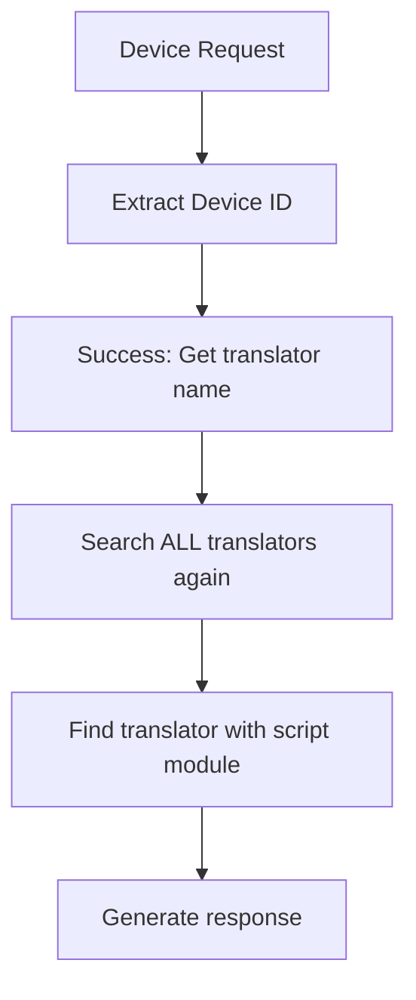
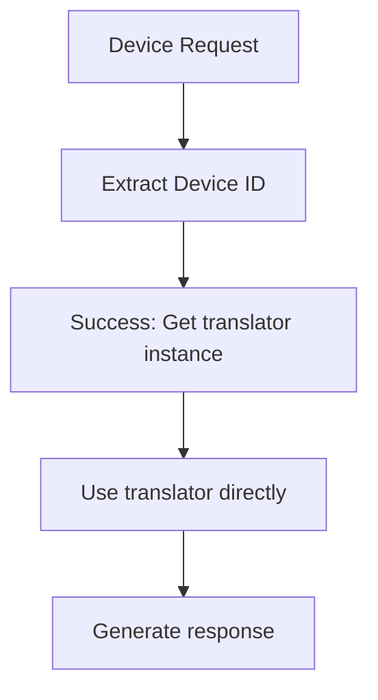

# CoAP Command Response Architecture Plan

## Problem Statement

The CoAP connector's command consumer needs to generate appropriate responses when delivering commands to devices. However, response generation logic is manufacturer-specific:

- **Efento devices**: Require `current_time` in response payload
- **Other manufacturers**: May require different response formats
- **Generic devices**: May only need standard CoAP ACK

The challenge is maintaining device-agnostic code in the command consumer while supporting manufacturer-specific response logic that belongs in parser scripts.

## Current Architecture Limitation

```
┌─────────────────┐    ┌─────────────────┐    ┌─────────────────┐
│   CommandConsumer   │    │    DataRootResource │    │   CoAP Device   │
│   (Device Agnostic) │    │   (Protocol Handler)│    │  (Manufacturer  │
│                     │    │                     │    │   Specific)     │
└─────────────────┘    └─────────────────┘    └─────────────────┘
         │                        │                        │
         │ 1. Format Command      │                        │
         │                        │                        │
         │ 2. Store Command       │                        │
         │                        │                        │
         │                        │ 3. Device Contacts     │
         │                        │◄──────────────────────│
         │                        │                        │
         │ 4. Get Command         │                        │
         │◄──────────────────────│                        │
         │                        │                        │
         │ 5. Return Command      │                        │
         │──────────────────────▶│                        │
         │                        │                        │
         │ ❌ MISSING: Response   │ 6. Send Command +      │
         │    Generation Logic    │    Response            │
         │                        │──────────────────────▶│
```

**Issue**: Step 6 requires manufacturer-specific response generation, but this logic cannot be in the device-agnostic `CommandConsumer` or `DataRootResource`.

## Proposed Solution: Parser-Based Response Generation

### Architecture Overview

Extend the parser interface to include response generation that works independently of command presence:

```
┌─────────────────┐    ┌─────────────────┐    ┌─────────────────┐
│   CommandConsumer   │    │    DataRootResource │    │   CoAP Device   │
│   (Device Agnostic) │    │   (Protocol Handler)│    │  (Manufacturer  │
│                     │    │                     │    │   Specific)     │
└─────────────────┘    └─────────────────┘    └─────────────────┘
         │                        │                        │
         │ 1. Format Command      │                        │
         │    + Response          │                        │
         │                        │                        │
         │ 2. Store Command       │                        │
         │    + Response          │                        │
         │                        │                        │
         │                        │ 3. Device Contacts     │
         │                        │◄──────────────────────│
         │                        │                        │
         │ 4a. Get Command +      │                        │
         │     Response           │                        │
         │◄──────────────────────│                        │
         │                        │                        │
         │ 4b. OR Generate        │                        │
         │     ACK Response       │                        │
         │◄──────────────────────│                        │
         │                        │                        │
         │ 5. Return Response     │                        │
         │    (With/Without Cmd)  │                        │
         │──────────────────────▶│                        │
         │                        │                        │
         │                        │ 6. Send Response       │
         │                        │    (±Command)          │
         │                        │──────────────────────▶│
```

### Two Response Scenarios

1. **Command Present**: Send command + manufacturer-specific response
2. **No Command**: Send manufacturer-specific acknowledgment response

### Core Components

#### 1. Extended Parser Interface

Add a new mandatory function to all parser scripts:

```python
def format_response(command: Optional[dict], translator: Any, config: dict) -> bytes:
    """
    Generate appropriate response payload for device communication.

    Args:
        command: The command that was sent to the device (None if no command)
        translator: Translator instance for device communication
        config: Hardware configuration dictionary

    Returns:
        bytes: Response payload to include in CoAP response

    Raises:
        NotImplementedError: If response generation not supported
        ValueError: If command format is invalid
    """
```

#### 2. Response Generation Context

The response generation should handle two scenarios:

```python
# Scenario 1: Command present - include command-specific response
response_bytes = format_response(command_dict, translator, config)

# Scenario 2: No command - generate acknowledgment response
response_bytes = format_response(None, translator, config)
```

#### 3. Enhanced Command Storage

Modify the command storage structure to include response data:

```python
@dataclass
class FormattedCommand:
    """Enhanced command storage with response generation."""
    command_bytes: bytes
    response_bytes: bytes
    command_metadata: Dict[str, Any]
    response_metadata: Dict[str, Any]
    created_at: float
    expires_at: Optional[float] = None
```

#### 4. Modified Command Consumer Flow

Update the command processing flow to generate both command and response:

```python
async def _format_command_with_parser(self, device_id: str, command_message: CommandMessage) -> Optional[FormattedCommand]:
    """
    Format both command and response using device-specific parser.

    Returns:
        FormattedCommand with both command and response bytes
    """
    # ... existing command formatting logic ...

    # Generate response using parser
    response_bytes = script_module.format_response(
        command=command_dict,
        translator=translator,
        config=hardware_config
    )

    return FormattedCommand(
        command_bytes=command_bytes,
        response_bytes=response_bytes,
        command_metadata={"formatted_by": "parser"},
        response_metadata={"generated_at": time.time()},
        created_at=time.time()
    )
```

## Implementation Details

### 1. Parser Script Changes

#### Efento Parser (`coap_parser.py`)

```python
def format_response(command: Optional[dict], translator: Any, config: dict) -> bytes:
    """
    Generate Efento-specific response payload.

    For Efento devices, response should contain current time configuration.
    Works for both command delivery and standard acknowledgments.
    """
    command_type = command.get('command_type') if command else 'acknowledgment'
    logger.info(f"Generating Efento response for: {command_type}")

    try:
        # Create ProtoConfig with current time
        proto_class = translator.message_parser.proto_modules["config"]["class"]
        proto_message = proto_class()

        # Set current time (Efento-specific requirement for all responses)
        proto_message.current_time = int(time.time())

        if command:
            # Command-specific response logic
            if command.get('command_type') == 'config':
                proto_message.request_configuration = True
            elif command.get('command_type') == 'alarm':
                proto_message.request_configuration = True
            # Add other command-specific logic as needed
        else:
            # Standard acknowledgment response
            proto_message.request_configuration = True

        # Serialize to bytes
        response_bytes = proto_message.SerializeToString()

        if not response_bytes:
            raise RuntimeError("Failed to serialize response")

        logger.info(f"Generated Efento response: {len(response_bytes)} bytes")
        return response_bytes

    except Exception as e:
        logger.error(f"Failed to generate Efento response: {e}")
        raise RuntimeError(f"Response generation failed: {e}") from e
```

#### Generic Parser Template

```python
def format_response(command: Optional[dict], translator: Any, config: dict) -> bytes:
    """
    Generate generic response payload.

    For devices that don't require specific response data,
    return empty payload (standard CoAP ACK).
    """
    command_type = command.get('command_type') if command else 'acknowledgment'
    logger.info(f"Generating generic response for: {command_type}")

    # Most devices don't need specific response payload
    # CoAP ACK is sufficient for both commands and acknowledgments
    return b""
```

### 2. Command Consumer Changes

#### Enhanced Command Storage

```python
class CommandConsumer:
    def __init__(self):
        # Change from simple dict to structured storage
        self.pending_commands: Dict[str, List[FormattedCommand]] = {}

    async def _store_formatted_command(self, device_id: str, command_message: CommandMessage, formatted_command: FormattedCommand):
        """Store formatted command with response."""
        enhanced_command = {
            'request_id': command_message.request_id,
            'command_type': command_message.command_type,
            'device_id': device_id,
            'command_payload': formatted_command.command_bytes.hex(),
            'response_payload': formatted_command.response_bytes.hex(),
            'formatted_by': 'parser',
            'created_at': formatted_command.created_at,
            'expires_at': formatted_command.expires_at
        }

        if device_id not in self.pending_commands:
            self.pending_commands[device_id] = []
        self.pending_commands[device_id].append(enhanced_command)
```

#### Enhanced Command Retrieval

```python
async def get_formatted_command_with_response(self, device_id: str) -> Optional[Tuple[bytes, bytes]]:
    """
    Get formatted command and response for a device.

    Returns:
        Tuple of (command_bytes, response_bytes) or None if no commands available
    """
    if not self.pending_commands.get(device_id):
        return None

    command = self.pending_commands[device_id][0]

    try:
        command_hex = command.get('command_payload', '')
        response_hex = command.get('response_payload', '')

        command_bytes = bytes.fromhex(command_hex) if command_hex else b""
        response_bytes = bytes.fromhex(response_hex) if response_hex else b""

        return command_bytes, response_bytes

    except Exception as e:
        logger.exception(f"Error getting formatted command and response: {e}")
        return None
```

### 3. DataRootResource Changes

#### Enhanced Response Generation

```python
async def render(self, request):
    """Enhanced request handler with response generation."""
    # ... existing code for device ID extraction and raw message creation ...

    # Check for pending commands first
    if self.command_consumer:
        try:
            command_response = await self.command_consumer.get_formatted_command_with_response(translation_result.device_id)

            if command_response:
                command_bytes, response_bytes = command_response

                # Get command details for logging
                pending_commands = self.command_consumer.get_pending_commands(translation_result.device_id)
                command_id = pending_commands[0].get("request_id", "unknown") if pending_commands else "unknown"

                logger.info(f"[{request_id}] Sending command {command_id} with response to device {translation_result.device_id}")

                # Acknowledge command delivery
                if pending_commands:
                    self.command_consumer.acknowledge_command(translation_result.device_id, command_id)

                # Create CoAP response with both command and response
                response_payload = command_bytes + response_bytes if response_bytes else command_bytes

                return aiocoap.Message(
                    mtype=aiocoap.ACK,
                    code=aiocoap.Code.CREATED,
                    token=request.token,
                    payload=response_payload
                )

        except Exception as e:
            logger.error(f"[{request_id}] Error handling command with response: {e}")

    # No command present - generate acknowledgment response
    if translation_result and translation_result.success and translation_result.device_id:
        try:
            # Generate manufacturer-specific acknowledgment response
            ack_response = await self._generate_acknowledgment_response(translation_result.device_id)

            if ack_response:
                logger.info(f"[{request_id}] Sending acknowledgment response to device {translation_result.device_id}")
                return aiocoap.Message(
                    mtype=aiocoap.ACK,
                    code=aiocoap.Code.CONTENT,
                    token=request.token,
                    payload=ack_response
                )
            else:
                # Fall back to standard ACK
                return aiocoap.Message(
                    mtype=aiocoap.ACK,
                    code=aiocoap.Code.CONTENT,
                    token=request.token
                )

        except Exception as e:
            logger.error(f"[{request_id}] Error generating acknowledgment response: {e}")
            # Fall back to standard ACK
            return aiocoap.Message(
                mtype=aiocoap.ACK,
                code=aiocoap.Code.CONTENT,
                token=request.token
            )

    # ... rest of existing code ...

async def _generate_acknowledgment_response(self, device_id: str) -> Optional[bytes]:
    """
    Generate manufacturer-specific acknowledgment response when no command is present.
    """
    try:
        # Get translator for this device (using same logic as command consumer)
        translator = await self.command_consumer._get_translator_for_device(device_id)

        if translator:
            # Get parser script path from translator config
            parser_script_path = self._get_parser_script_path_for_device(device_id)

            if parser_script_path:
                # Load parser module
                script_module = await self.command_consumer._get_parser_module(parser_script_path)

                if script_module and hasattr(script_module, 'format_response'):
                    # Generate acknowledgment response (no command)
                    response_bytes = script_module.format_response(
                        command=None,  # No command present
                        translator=translator,
                        config={}
                    )

                    return response_bytes

    except Exception as e:
        logger.error(f"Error generating acknowledgment response for device {device_id}: {e}")

    return None

def _get_parser_script_path_for_device(self, device_id: str) -> Optional[str]:
    """
    Get parser script path for a device.
    This could be enhanced to use device registry or metadata.
    """
    # For now, use default parser path based on translator config
    # In a full implementation, this could look up device-specific parser paths
    return "coap_parser.py"  # Default for CoAP devices
```

## Configuration Changes

### Parser Script Registration

Update the connector configuration to ensure all parsers implement the response interface:

```yaml
connectors:
  - connector_id: "coap-connector"
    translators:
      - type: "protobuf"
        config:
          response_generation:
            enabled: true
            default_response_type: "time_sync" # For Efento
            validation:
              required_functions: ["format_command", "format_response"]
```

## Benefits

### 1. **Architectural Consistency**

- Device-specific logic remains in parser scripts
- Command consumer stays device-agnostic
- Clear separation of concerns maintained

### 2. **Flexibility**

- Each manufacturer can implement custom response logic for both commands and acknowledgments
- Generic parsers can use standard CoAP ACK
- Easy to add new response types
- **Independent response generation** - works with or without commands

### 3. **Performance**

- Command responses pre-generated during command processing
- Acknowledgment responses generated on-demand but cached
- No runtime response generation overhead for commands
- Efficient command delivery and acknowledgments

### 4. **Maintainability**

- Response logic co-located with command formatting
- Single parser file per manufacturer handles all response scenarios
- Easy to test and debug both command and acknowledgment flows

### 5. **Protocol Compliance**

- **Manufacturer-specific acknowledgments** - devices like Efento get proper `current_time` responses
- Standard CoAP ACK for generic devices
- Proper response codes and payloads for different scenarios

## Migration Path

### Phase 1: Interface Extension

1. Add `format_response()` to existing parser scripts
2. Implement default (empty) response for generic devices
3. Implement Efento-specific response logic

### Phase 2: Command Consumer Updates

1. Modify command storage to include response data
2. Update command formatting to generate responses
3. Enhance command retrieval methods

### Phase 3: DataRootResource Integration

1. Update response handling to use generated response data
2. Implement combined command + response payload
3. Add enhanced logging and monitoring

### Phase 4: Testing & Validation

1. Test with existing Efento devices
2. Validate generic device compatibility
3. Performance testing with high command volumes

## Error Handling

### Response Generation Failures

- Fall back to standard CoAP ACK if response generation fails
- Log detailed error information for debugging
- Maintain command delivery even if response fails

### Backward Compatibility

- Support parsers without `format_response()` function
- Graceful degradation to current behavior
- Migration warnings for deprecated parser interfaces

## Monitoring & Observability

### New Metrics

- Command response generation success rate
- Acknowledgment response generation success rate
- Response payload sizes (command vs acknowledgment)
- Command+response delivery latency
- Acknowledgment response latency
- Parser response cache hit rates

### Enhanced Logging

- Response generation details (command vs acknowledgment)
- Combined payload sizes
- Manufacturer-specific response metadata
- Error traces for response failures
- Device-specific acknowledgment patterns

## Translation Result Optimization (Architectural Simplification)

### Problem Statement

Even after integrating parser scripts into translators, we were still doing unnecessary work:

- **CoAP Connector**: Searching through all translators to find one with a script module
- **Redundant Lookups**: Re-discovering translator capabilities that were already known
- **Inefficiency**: Multiple translator iterations when we already had the right translator

### Solution: Use Translator from Translation Result

The `TranslationManager` already stores the successful translator instance in the translation result:

```python
# In TranslationManager.extract_device_id()
if result.success and result.device_id:
    result.translator = translator  # ✅ Translator instance preserved!
    return result
```

### Implementation Simplification

#### **Before (Inefficient Search):**

```python
async def _generate_acknowledgment_response(self, device_id: str) -> Optional[bytes]:
    # Search through ALL translators to find one with script module
    translator_with_script = None
    for translator in self.translation_manager.translators:
        if hasattr(translator, 'script_module') and translator.script_module:
            translator_with_script = translator
            break
        elif hasattr(translator, 'parser_script_path') and translator.parser_script_path:
            # Try loading script module...
            # More complex logic...
    # Use translator_with_script...
```

#### **After (Direct Access):**

```python
async def _generate_acknowledgment_response(self, device_id: str, translator=None) -> Optional[bytes]:
    # Use the translator that was already successful for device ID extraction!
    if translator and hasattr(translator, 'script_module'):
        # Direct usage - no searching needed! 🎯
        script_module = translator.script_module
        # Generate response...

# Usage in main flow:
ack_response = await self._generate_acknowledgment_response(
    translation_result.device_id,
    translation_result.translator  # ✅ Direct translator access!
)
```

### Architectural Benefits

1. **🎯 Zero Redundancy**: Use the translator that already proved it can handle the device
2. **⚡ Better Performance**: No need to iterate through all translators again
3. **🔧 Cleaner Code**: Eliminated complex translator search logic
4. **🛡️ Better Reliability**: Same translator for extraction and response generation ensures consistency
5. **📉 Reduced Complexity**: Removed `_get_parser_script_path_for_device()` method entirely

### Logic Flow Comparison

#### **Before:**



#### **After:**



### Code Elimination

**Removed Methods:**

- `_get_parser_script_path_for_device()` - No longer needed
- Complex translator search loops - Replaced with direct access

**Simplified Usage:**

```python
# Old: Multiple steps with search
parser_script_path = self._get_parser_script_path_for_device(device_id)
translator = # ... search for translator with this script path

# New: Direct access
translator = translation_result.translator  # Done! 🎉
```

### Performance Impact

- **Reduced Iterations**: From O(n) translator search to O(1) direct access
- **Faster Response Times**: Immediate translator availability
- **Lower Memory Usage**: No need to cache translator lookups
- **Simplified Error Handling**: Single point of translator access

This optimization represents the principle of **"Don't search for what you already have"** - a fundamental improvement in architectural efficiency.

---

## Summary

This enhanced parser-based response generation approach addresses the key requirement: **manufacturer-specific responses work independently of command presence**.

### Key Improvements:

1. **Independent Response Generation**: Efento devices get `current_time` responses whether commands are present or not
2. **Architectural Consistency**: Device-specific logic stays in parser scripts
3. **Dual-Mode Operation**: Single parser function handles both command responses and acknowledgments
4. **Graceful Fallback**: Standard CoAP ACK if response generation fails

### For Efento Specifically:

- **With Command**: Returns command + `current_time` response
- **Without Command**: Returns `current_time` acknowledgment (addresses your highlighted code concern)

**Decision Required**: Should we proceed with this enhanced parser-based response generation approach?
