# Light Controller Cache-Aware Parser Solution Design

## 🎯 Solution Overview

This document outlines a **Cache-Aware Parser** solution to fix the light controller state management problem while maintaining architectural principles and MQTT connector agnosticism.

## 🏗️ Design Principles

### Maintained Constraints
- ✅ **MQTT Connector Agnosticism**: No manufacturer-specific logic
- ✅ **Parser Isolation**: Parser scripts remain self-contained
- ✅ **Minimal Infrastructure Changes**: Leverage existing components
- ✅ **Backwards Compatibility**: Regular sensors unaffected

### New Capabilities
- 🆕 **Optional Cache Access**: Parsers can query current cache state
- 🆕 **Intelligent State Merging**: Preserve existing data when appropriate
- 🆕 **Operation-Aware Processing**: Different logic for different device operations

## 📋 Solution Architecture

### High-Level Approach

```mermaid
sequenceDiagram
    participant UI as Frontend
    participant CACHE as Cache Service
    participant NORM as Normalizer
    participant PARSER as Parser (Enhanced)
    participant DEV as Device

    Note over UI,DEV: ✅ FIXED: Parser can access current cache state

    DEV->>NORM: Device response (partial data)
    NORM->>PARSER: parse(payload, metadata, config, cache_context)
    
    Note over PARSER: 🔍 Parser detects operation needs state
    
    PARSER->>CACHE: get_current_reading(device_id, category)
    CACHE->>PARSER: Current cached task data
    
    Note over PARSER: 🔄 Merge device response + cached state
    
    PARSER->>NORM: Updated reading (preserves existing data)
```



## 🔧 Technical Implementation

### 1. Enhanced Parser Interface

#### Current Parser Signature
```python
def parse(payload: str, metadata: dict, config: dict, message_parser=None) -> ParseResult:
    pass
```

#### Enhanced Parser Signature
```python
def parse(payload: str, metadata: dict, config: dict, message_parser=None, cache_context=None) -> ParseResult:
    """
    Enhanced parser with optional cache access.
    
    Args:
        payload: Device response payload
        metadata: MQTT message metadata
        config: Hardware configuration
        message_parser: Optional message parser
        cache_context: Optional cache access interface (NEW)
    """
    pass
```

### 2. Cache Context Interface

```python
class CacheContext:
    """Provides cache access interface for parsers."""
    
    def __init__(self, cache_service):
        self.cache_service = cache_service
    
    async def get_current_reading(self, device_id: str, category: str) -> Optional[dict]:
        """Get current cached reading for device/category."""
        try:
            readings = await self.cache_service.get_readings_by_category(device_id, [category], False)
            return readings.get(category, [None])[0]
        except Exception as e:
            logger.warning(f"Failed to get cached reading for {device_id}/{category}: {e}")
            return None
    
    async def reading_exists(self, device_id: str, category: str) -> bool:
        """Check if cached reading exists."""
        reading = await self.get_current_reading(device_id, category)
        return reading is not None
```

### 3. Enhanced Light Controller Parser

```python
class UnifiedReadingManager:
    """Enhanced manager with cache-aware capabilities."""
    
    @staticmethod
    async def get_or_create_unified_reading(metadata: dict, device_id: str, cache_context=None) -> dict:
        """Get current reading from cache or create new one."""
        
        # Try to get current reading from cache if available
        if cache_context:
            cached_reading = await cache_context.get_current_reading(device_id, 'L')
            if cached_reading:
                logger.info(f"Retrieved current reading from cache for device {device_id}")
                return cached_reading
        
        # Fallback: Create base reading (for fresh devices or cache unavailable)
        logger.info(f"Creating fresh reading for device {device_id}")
        return UnifiedReadingManager.create_base_reading(device_id, metadata)

    @staticmethod 
    def should_preserve_existing_data(operation_type: str) -> bool:
        """Determine if operation should preserve existing cached data."""
        # Operations that only provide partial data and should preserve existing state
        PRESERVE_STATE_OPERATIONS = {'read_all'}
        return operation_type in PRESERVE_STATE_OPERATIONS

async def parse(payload: str, metadata: dict, config: dict, message_parser=None, cache_context=None) -> Optional[ParseResult]:
    """Enhanced parser with cache awareness."""
    
    device_id = metadata.get('device_id', 'unknown')
    
    try:
        # Decode device response
        binary_data = binascii.unhexlify(payload)
        decoded = LightProtocolDecoder.decode_packet(binary_data)
        operation = decoded['operation']
        
        logger.info(f"Device {device_id} operation: {operation}")
        
        # Get current reading (from cache if available, or create fresh)
        unified_reading = await UnifiedReadingManager.get_or_create_unified_reading(
            metadata, device_id, cache_context
        )
        
        # Update reading based on operation
        updated_reading = UnifiedReadingManager.update_reading_from_operation(
            unified_reading, decoded, operation, metadata
        )
        
        # Log state preservation info
        if UnifiedReadingManager.should_preserve_existing_data(operation):
            active_tasks = sum(1 for active in updated_reading['values'][4] if active)
            logger.info(f"Operation '{operation}' preserved {active_tasks} existing tasks")
        
        return ParseResult("data", [updated_reading])
        
    except Exception as e:
        logger.error(f"Error parsing light controller response: {e}")
        return None
```

### 4. Normalizer Service Enhancement

```python
class NormalizerService:
    """Enhanced normalizer with cache context support."""
    
    def __init__(self, cache_service):
        self.cache_service = cache_service
        self.cache_context = CacheContext(cache_service)
    
    async def _process_message(self, raw_msg_record):
        """Enhanced message processing with cache context."""
        
        # ... existing setup code ...
        
        # Get parser function
        action = raw_message.action or "parse"
        parse_function = getattr(script_module, action)
        
        # Check if parser supports cache context (backwards compatibility)
        import inspect
        parser_signature = inspect.signature(parse_function)
        supports_cache_context = 'cache_context' in parser_signature.parameters
        
        # Call parser with or without cache context
        if supports_cache_context:
            logger.debug(f"Calling parser with cache context for device {device_id}")
            action_result = parse_function(
                payload=payload_bytes,
                metadata=raw_message.metadata,
                config=hardware_config,
                message_parser=getattr(translator_instance, 'message_parser', None),
                cache_context=self.cache_context  # NEW
            )
        else:
            # Backwards compatibility for parsers that don't support cache context
            logger.debug(f"Calling parser without cache context for device {device_id}")
            action_result = parse_function(
                payload=payload_bytes,
                metadata=raw_message.metadata,
                config=hardware_config,
                message_parser=getattr(translator_instance, 'message_parser', None)
            )
        
        # ... rest of processing ...
```

## 🔄 Operation Flow Examples

### Read All Operation (Problematic Case)

#### Before (Broken)
```
1. Device responds: {task_count: 7}
2. Parser creates fresh reading: all tasks = default/inactive
3. Cache updated: task data lost
```

#### After (Fixed)
```
1. Device responds: {task_count: 7}
2. Parser detects 'read_all' operation
3. Parser queries cache: gets current task data
4. Parser merges: preserves existing tasks + updates count
5. Cache updated: existing tasks preserved, count = 7
```

### Create Task Operation (Normal Case)

#### Before and After (Same - Works Correctly)
```
1. Device responds: {task_id: 0, time_beg: 540, active: true}
2. Parser updates specific task data
3. Cache updated: task 0 configured correctly
```

## 🚀 Implementation Plan

### Phase 1: Core Infrastructure
1. **Create CacheContext class** in normalizer service
2. **Enhance parser interface** to accept optional cache_context parameter
3. **Update NormalizerService** to detect and provide cache context
4. **Add backwards compatibility** for existing parsers

### Phase 2: Light Controller Parser
1. **Update light_controller_parser.py** to use cache context
2. **Implement cache-aware reading retrieval**
3. **Add operation-specific state preservation logic**
4. **Remove metadata.values approach** (no longer needed)

### Phase 3: Testing & Validation
1. **Unit tests** for cache context functionality
2. **Integration tests** for light controller operations
3. **Backwards compatibility tests** for regular sensors
4. **Performance testing** for cache query overhead

### Phase 4: Frontend Cleanup
1. **Remove metadata.values** from command payloads
2. **Simplify metadataPayload** function
3. **Update documentation** and examples

## 📊 Impact Assessment

### Benefits
- ✅ **Fixes State Loss**: read_all operations preserve existing task data
- ✅ **Maintains Architecture**: MQTT connector remains agnostic
- ✅ **Backwards Compatible**: Existing parsers work unchanged
- ✅ **Performance Efficient**: Cache queries only when needed
- ✅ **Self-Contained**: Each parser decides its own cache needs

### Risks & Mitigations
- **Risk**: Cache query latency
  - **Mitigation**: Async operations, local cache, query only when needed
- **Risk**: Cache unavailability
  - **Mitigation**: Graceful fallback to fresh reading creation
- **Risk**: Parser complexity
  - **Mitigation**: Optional feature, simple interface, good documentation

### Performance Considerations
- **Cache Query Overhead**: ~10-50ms per operation (acceptable for light controllers)
- **Memory Impact**: Minimal (cache context is lightweight)
- **Network Impact**: Reduced (no need for large metadata payloads)

## 🧪 Testing Strategy

### Test Cases
1. **Fresh Device**: No cached reading exists → create fresh reading
2. **Read All with Cache**: Cached reading exists → preserve task data, update count
3. **Create Task**: Normal operation → update specific task
4. **Delete Task**: Normal operation → remove specific task  
5. **Cache Unavailable**: Cache service down → fallback to fresh reading
6. **Backwards Compatibility**: Regular sensor parser → works without cache context

### Success Criteria
- ✅ Light controller read_all preserves existing task configurations
- ✅ Light controller create/delete/read_task operations work normally
- ✅ Regular sensors continue working without changes
- ✅ System performance impact < 5%
- ✅ Cache service outages don't break parsing

## 🎯 Expected Outcome

After implementation:

1. **User Experience**: "Rafraîchir" button preserves configured tasks
2. **Data Integrity**: No more lost task configurations
3. **Architecture**: Clean, maintainable, backwards compatible
4. **Performance**: Minimal overhead, efficient cache usage
5. **Maintainability**: Self-documenting, operation-aware parsing

This solution addresses the core architectural issue while respecting system design principles and maintaining compatibility with existing components.