# Light Controller Cache State Problem Analysis

## 🚨 Problem Summary

The light controller unified reading system has an **architectural flaw** where `read_all` operations overwrite existing task data in the cache, even though the device only provides task count (not individual task details). This causes existing task configurations to be lost when users refresh tasks.

## 🔍 Root Cause Analysis

### The Architecture Issue

The problem stems from a **disconnect between command metadata and parser metadata**:

1. **Frontend Command Flow**: 
   ```
   Frontend → CommandService → Kafka → CommandConsumer → MQTT → Device
   ```
   - Command metadata includes current readings (`metadata.values`)
   - This metadata is used for command formatting only

2. **Device Response Flow**:
   ```
   Device → MQTT → MQTTClientWrapper → Kafka → NormalizerService → Parser
   ```
   - Parser receives **raw_message.metadata** (from MQTT response)
   - This metadata has **NO CONNECTION** to command metadata
   - Parser creates fresh reading with default values

### The Broken Flow

```mermaid
sequenceDiagram
    participant UI as Frontend
    participant CMD as Command Service
    participant MQTT as MQTT Connector
    participant DEV as Light Device
    participant NORM as Normalizer
    participant PARSER as Parser
    participant CACHE as Cache

    Note over UI,CACHE: ❌ BROKEN: Command metadata ≠ Parser metadata

    UI->>CMD: read_all command with metadata.values (current tasks)
    CMD->>MQTT: Command sent to device
    MQTT->>DEV: Binary command
    DEV->>MQTT: Response with only task_count
    
    Note over MQTT,NORM: 📡 Response metadata has NO task data
    
    MQTT->>NORM: RawMessage with empty metadata
    NORM->>PARSER: parse(payload, raw_metadata, config)
    
    Note over PARSER: 🔥 Parser creates fresh reading (task data lost!)
    
    PARSER->>CACHE: Fresh reading overwrites existing tasks
```



### Specific Technical Issues

#### 1. **Metadata Isolation**
- **Command Metadata**: Contains `values: [current_task_data]` from frontend
- **Parser Metadata**: Contains `{device_id, mqtt_topic, protocol}` from MQTT response
- **No Bridge**: These two metadata objects are completely separate

#### 2. **Parser Entry Point**
```python
# In NormalizerService._process_message()
action_result = getattr(script_module, action)(
    payload=payload_bytes,          # ✅ Device response
    metadata=raw_message.metadata,  # ❌ MQTT metadata (no task data)
    config=hardware_config,         # ✅ Hardware config
    message_parser=None
)
```

The `raw_message.metadata` comes from MQTT response and contains:
```python
{
    'device_id': '2121004',
    'mqtt_topic': '2121004/scheduler_data', 
    'protocol': 'mqtt',
    'mqtt_qos': 0,
    'mqtt_retain': False
    # ❌ NO 'values' or current task data
}
```

#### 3. **Design Isolation Principle**
The architecture **intentionally isolates** manufacturer-specific logic:
- MQTT connector is agnostic of light controller specifics
- Parser should be self-contained
- **But this breaks state management for stateful devices**

## 📋 Current Behavior vs Expected

### Current (Broken) Behavior
1. User has task: `{id: 0, time_beg: 540, active: true}`
2. User clicks "Refresh" (read_all)
3. Device responds: `{task_count: 7}` (no individual task data)
4. Parser receives empty metadata
5. Parser creates fresh reading with defaults
6. Cache updated: `{task_active: [false, false, ...], task_count: 7}`
7. **Task data lost!** UI shows "Aucune tâche programmée"

### Expected (Correct) Behavior  
1. User has task: `{id: 0, time_beg: 540, active: true}`
2. User clicks "Refresh" (read_all)
3. Device responds: `{task_count: 7}`
4. Parser **preserves existing task data** and only updates count
5. Cache updated: `{task_active: [true, false, ...], task_count: 7}`
6. **Task data preserved!** UI shows existing task + updated count

## 🏗️ Architecture Constraints

### What We Cannot Change
1. **MQTT Connector Agnosticism**: Must remain manufacturer-agnostic
2. **Parser Isolation**: Parser scripts should be self-contained
3. **Kafka Message Flow**: Raw messages flow through Kafka as designed
4. **Normalizer Service**: General-purpose message processing

### What We Need
1. **State Persistence**: Parser needs access to current cache state
2. **Stateful Operations**: Some operations need to preserve existing data
3. **Device Limitations**: Hardware only provides partial data (count, not details)

## 💡 Potential Solution Approaches

### Approach 1: Cache-Aware Parser
- Parser queries current cache state before processing
- Merge device response with existing cached data
- **Pros**: Clean, self-contained
- **Cons**: Parser becomes cache-dependent

### Approach 2: Extended Raw Message
- Enhance RawMessage to include context about related commands
- Bridge command metadata to parser metadata
- **Pros**: Maintains isolation
- **Cons**: Complex correlation logic

### Approach 3: Stateful Parser Context
- Create parser context service for stateful devices
- Parser can request current state when needed
- **Pros**: Explicit state management
- **Cons**: Additional infrastructure complexity

### Approach 4: Operation-Type Metadata
- MQTT connector adds operation type to metadata
- Parser uses operation type to determine state handling
- **Pros**: Minimal changes
- **Cons**: MQTT connector becomes less agnostic

## 🎯 Recommended Solution Direction

**Hybrid Approach**: Cache-Aware Parser with Operation Context

1. **Parser Enhancement**: Allow parser to query current cache state
2. **Operation Detection**: Infer operation type from device response
3. **Conditional State Merge**: Only merge when operation requires it
4. **Maintain Isolation**: Keep MQTT connector agnostic

This preserves architectural principles while solving the state management problem for stateful devices like light controllers.

## 🔍 Impact Assessment

### Affected Components
- ✅ **Parser Scripts**: Need cache access capability
- ✅ **Normalizer Service**: May need to provide cache context
- ❌ **MQTT Connector**: Remains unchanged (agnostic)
- ❌ **Command Service**: Remains unchanged  
- ❌ **Frontend**: Remains unchanged

### Device Types Affected
- **Light Controllers**: Primary affected (stateful task management)
- **Regular Sensors**: No impact (stateless measurements)
- **Other Stateful Devices**: Would benefit from solution

This problem highlights the challenge of managing stateful device interactions in a system designed for stateless sensor data collection.